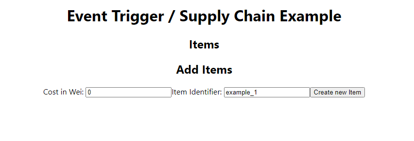

##
## Udemy Supplychain Project
- project goes through basic event handling, unit testing, and react coding
- introduction to low level calls with custom gas for extra functionality
- basic use of openzeppelin ownable.sol
##

