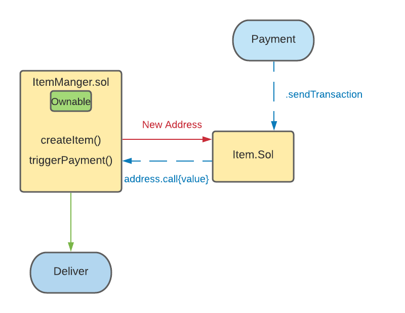

##
## Udemy Supplychain Project

[link](https://www.udemy.com/course/blockchain-developer/) to course

- project goes through basic event handling, unit testing, and react coding
- introduction to low level calls with custom gas for extra functionality (instead of transfer() function)
- use of someAddress.call{gas: x, value: y}(data) for contract to contract interaction
```
(bool success, ) = address(parentContract).call{value:msg.value}(abi.encodeWithSignature("triggerPayment(uint256)",index));
```
- basic use of openzeppelin ownable.sol
- smart contract deployment through a smart contract
- use of receive/fallback formatting for solidity >= 6

## Instructions
1.  Create a new item and specify its cost and identifier (id)
2.  Make an payment to the new item contract that was created. This can be done through metamask or manually through truffle console using the following code (value in wei):
```
web3.eth.sendTransaction({to: "0x123..", value: 100, gas: 300000})
```
3. Look for confirmation item was paid


***NOTE:***
The triggerDelivery() function in our ItemManager.sol contract is not used in the tutorial for whatever reason, but marks the next step in the supplychain process.  Also, there is only 1 event emitter, which makes the code more compact. 

## Design



##

